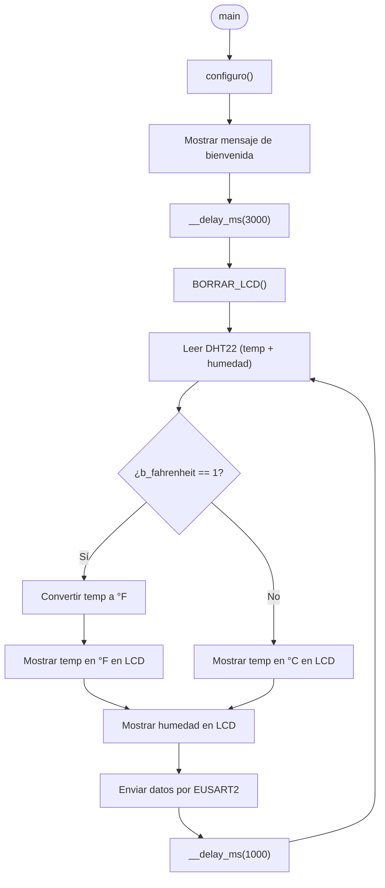
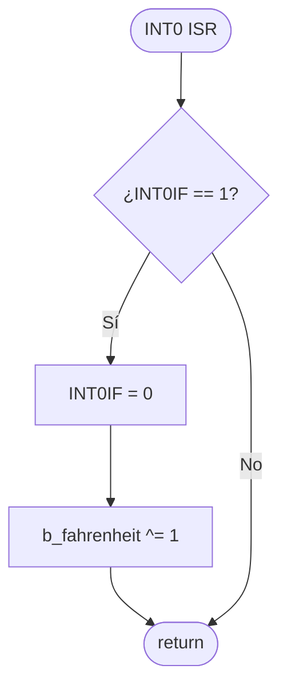

# PIC18F47Q10 – Thermometer EUSART

> [!NOTE]
> Este proyecto forma parte de [**TheAssemblyChronicles-PIC**](https://remgo696.github.io/TheAssemblyChronicles-PIC/), una serie de proyectos, documentación y guías rápidas orientadas al aprendizaje de los microcontroladores PIC18F. 
Puedes encontrar más proyectos [aquí](https://remgo696.github.io/TheAssemblyChronicles-PIC/proyectos/).

---

## Descripción del Proyecto

Se implementa un termómetro digital sobre el microcontrolador **PIC18F47Q10**. El sistema lee temperatura y humedad relativa desde un sensor **DHT22** (conectado en RA0), muestra los valores en un **LCD 16×2** (interfaz de 4 bits) y los transmite por **EUSART2** a 9600 baudios. Además, un **pulsador** conectado a **RB0** (pin por defecto de `INT0PPS`) permite alternar la unidad de temperatura entre **°C** y **°F** mediante una interrupción externa y un bit de estado (*flag*).

Para lograrlo se emplean los siguientes periféricos y recursos del PIC18F47Q10:

| Periférico | Función |
|:-----------|:--------|
| **Oscilador** | Reloj del sistema a 32 MHz (HFINTOSC) |
| **DHT22** | Sensor de temperatura y humedad relativa (conectado en RA0) |
| **LCD 16×2** | Visualización de datos (4 bits; control en PORTC [RC0–RC2], datos en PORTD [RD4–RD7]) |
| **EUSART2** | Transmisión serial asíncrona a 9600 baudios (TX en RD0 vía PPS) |
| **INT0** | Interrupción externa por flanco de bajada para botón °C/°F (RB0) |

<!-- La imagen se añadirá cuando esté disponible -->


---

## Configuración del Reloj del Sistema (32 MHz)

Se utiliza el oscilador interno de alta frecuencia (HFINTOSC) a 32 MHz sin divisor. Se requiere esta frecuencia para cumplir con las temporización requerida por el protocolo *one-wire* del DHT22 y con el *baud rate* del EUSART2. Para ello se configuran tres registros.

### Registros del Oscilador

**OSCCON1** – Oscillator Control Register 1

| Bit | 7 | 6:4 | 3:0 |
|:---:|:---:|:---:|:---:|
| **Campo** | — | NOSC[2:0] | NDIV[3:0] |
| **Permisos** | — | R/W | R/W |

**OSCFRQ** – HFINTOSC Frequency Selection Register

El registro `OSCFRQ` solo tiene un campo y se descompone como  `-[7:3]:FRQ[2:0]`.

| FRQ[2:0] | Frecuencia HFINTOSC |
|:--------:|:-------------------:|
| 000 | 1 MHz |
| 001 | 2 MHz |
| 010 | 4 MHz |
| 011 | 8 MHz |
| 100 | 12 MHz |
| 101 | 16 MHz |
| 110 | 32 MHz |
| 111 | 64 MHz |

**OSCEN** – Oscillator Enable Register

| Bit | 7 | 6 | 5 | 4 | 3 | 2 | 1:0 |
|:---:|:---:|:---:|:---:|:---:|:---:|:---:|:---:|
| **Campo** | EXTOEN | HFOEN | MFOEN | LFOEN | SOSCEN | ADOEN | — |
| **Permisos** | R/W | R/W | R/W | R/W | R/W | R/W | — |
| **Reset** | 0 | 0 | 0 | 0 | 0 | 0 | — |

### Valores seleccionados

| Registro | Valor | Justificación |
|:--------:|:-----:|:--------------|
| `OSCCON1` | `0x60` | NOSC = 110 (HFINTOSC), NDIV = 0000 (1:1) |
| `OSCFRQ`  | `0x06` | FRQ = 110 → 32 MHz |
| `OSCEN`   | `0x40` | HFOEN = 1 → habilitar HFINTOSC |

Con esta configuración, $F_{osc} = 32\ \text{MHz}$.

```c
OSCCON1 = 0x60;  // HFINTOSC, sin divisor
OSCFRQ  = 0x06;  // 32 MHz
OSCEN   = 0x40;  // Habilitar HFINTOSC
```

---

## Configuración del EUSART2 (UART a 9600 Baudios)

### Velocidad de transmisión (9600 Baud)

El módulo EUSART2 se configura en modo **asíncrono de alta velocidad** (BRGH = 1, BRG16 = 0). La velocidad de transmisión se establece mediante el registro `SP2BRGL`:

$$\text{SP2BRGL} = \frac{F_{osc}}{16 \times \text{Baud Rate}} - 1$$

Con $F_{osc} = 32\ \text{MHz}$ y Baud Rate = 9600:

$$\text{SP2BRGL} = \frac{32\,000\,000}{16 \times 9600} - 1 = 208{,}33 - 1 \approx 207$$

**Velocidad real de transmisión:**

$$\text{Baud}_{real} = \frac{F_{osc}}{16 \times (\text{SP2BRGL} + 1)} = \frac{32\,000\,000}{16 \times 208} = 9615{,}38\ \text{baudios}$$

$$\text{Error} = \frac{9615{,}38 - 9600}{9600} \times 100 = 0{,}16\ \%$$

El error del 0,16 % se encuentra muy por debajo del ±2 % máximo tolerable en comunicación UART, garantizando una transmisión confiable.

### Registros del EUSART2

**TX2STA** – Transmit Status and Control Register

| Bit | 7 | 6 | 5 | 4 | 3 | 2 | 1 | 0 |
|:---:|:---:|:---:|:---:|:---:|:---:|:---:|:---:|:---:|
| **Campo** | CSRC | TX9 | TXEN | SYNC | SENDB | BRGH | TRMT | TX9D |
| **Permisos** | R/W | R/W | R/W | R/W | R/W | R/W | RO | R/W |
| **Reset** | 0 | 0 | 0 | 0 | 0 | 0 | 1 | 0 |

- `TXEN = 1`: habilitar transmisor
- `SYNC = 0`: modo asíncrono
- `BRGH = 1`: generador de *baud rate* de alta velocidad

**RC2STA** – Receive Status and Control Register

| Bit | 7 | 6 | 5 | 4 | 3 | 2 | 1 | 0 |
|:---:|:---:|:---:|:---:|:---:|:---:|:---:|:---:|:---:|
| **Campo** | SPEN | RX9 | SREN | CREN | ADDEN | FERR | OERR | RX9D |
| **Permisos** | R/W | R/W | R/W | R/W | R/W | RO | R/W | RO |
| **Reset** | 0 | 0 | 0 | 0 | 0 | 0 | 0 | 0 |

- `SPEN = 1`: habilitar el puerto serial (configura los pines TX/RX)

**BAUD2CON** – Baud Rate Control Register

| Bit | 7 | 6 | 5 | 4 | 3 | 2:0 |
|:---:|:---:|:---:|:---:|:---:|:---:|:---:|
| **Campo** | ABDOVF | RCIDL | — | SCKP | BRG16 | — |
| **Permisos** | R/W | RO | — | R/W | R/W | — |
| **Reset** | 0 | 1 | — | 0 | 0 | — |

- `BRG16 = 0`: generador de *baud rate* de 8 bits (solo `SP2BRGL`)

**RxyPPS** – PPS Output Selection

| RxyPPS | Módulo | Puerto destino |
|:------:|:------:|:--------------:|
| 0x0B | TX2/CK2 | RD0 |

> [!WARNING]
> En la placa Curiosity Nano, los pines RD0 y RD1 están conectados al debugger. Esto no impide su uso para EUSART2, pero debe tenerse en cuenta durante la depuración.

### Configuración completa del EUSART2

| Registro | Valor | Justificación |
|:--------:|:-----:|:--------------|
| `BAUD2CON` | `BRG16 = 0` | Generador de 8 bits (suficiente para 9600 baud a 32 MHz) |
| `SP2BRGL` | `207` | Baud rate ≈ 9615 baud (error 0,16 %) |
| `TX2STA` | `SYNC=0, TXEN=1` | Modo asíncrono, transmisor habilitado |
| `RC2STA` | `SPEN=1` | Puerto serial habilitado |
| `RD0PPS` | `0x0B` | Salida TX2 dirigida al pin RD0 mediante PPS |

```c
/* Baud Rate */
BAUD2CONbits.BRG16 = 0;      // Generador de 8 bits
SP2BRGL = 207;                // 9600 baud @ 32 MHz

/* PPS: TX2 → RD0 */
TRISDbits.TRISD0  = 0;       // RD0 como salida
ANSELDbits.ANSELD0 = 0;      // RD0 como digital
RD0PPS = 0x0B;               // Dirigir TX2 al pin RD0

/* EUSART2 */
TX2STAbits.SYNC = 0;          // Modo asíncrono
RC2STAbits.SPEN = 1;          // Habilitar puerto serial
TX2STAbits.TXEN = 1;          // Habilitar transmisor
```

---

## Configuración de la Interrupción Externa INT0 (Botón °C/°F)

### Propósito

Un pulsador normalmente abierto conectado a **RB0** (con resistencia *pull-up* interna) permite al usuario alternar la unidad de temperatura entre grados Celsius y Fahrenheit. El pin RB0 corresponde al **valor por defecto** del registro `INT0PPS` (`0x08`), por lo que no es necesario reasignar la fuente de la interrupción mediante PPS.

Al presionar el botón, se genera una interrupción por **flanco de bajada** que invoca la rutina de servicio (ISR). Dentro de la ISR se conmuta un bit de estado (`b_fahrenheit`):

- `b_fahrenheit = 0` → la temperatura se muestra en **°C** (valor por defecto).
- `b_fahrenheit = 1` → la temperatura se muestra en **°F**.

### Conversión °C → °F

La conversión de grados Celsius a Fahrenheit se realiza en software. Dado que el DHT22 entrega la temperatura en décimas de grado (por ejemplo, 256 = 25,6 °C), la conversión sobre el valor crudo es:

$$T_{°F \times 10} = \frac{9 \times T_{°C \times 10}}{5} + 320$$

Esto evita el uso de aritmética de punto flotante, manteniendo la operación eficiente con enteros de 16 bits.

### Registros de la Interrupción INT0

**INT0PPS** – INT0 Input PPS Selection

| Bit | 7:6 | 5:3 | 2:0 |
|:---:|:---:|:---:|:---:|
| **Campo** | — | PORT[2:0] | PIN[2:0] |
| **Permisos** | — | R/W | R/W |
| **Reset** | — | 001 | 000 |

El valor de reset `0x08` selecciona PORTB, bit 0 (RB0), que es exactamente el pin donde se conecta el pulsador. **No es necesario modificar este registro.**

**INTCON** – Interrupt Control Register

| Bit | 7 | 6 | 5 | 4:2 | 1 | 0 |
|:---:|:---:|:---:|:---:|:---:|:---:|:---:|
| **Campo** | GIE/GIEH | GIEL/PEIE | IPEN | — | INT0EDG | — |
| **Permisos** | R/W | R/W | R/W | — | R/W | — |
| **Reset** | 0 | 0 | 0 | — | 0 | — |

- `GIE = 1`: habilitar interrupciones globales
- `INT0EDG = 0`: flanco de bajada (el botón lleva la línea de alto a bajo al presionarse)

> [!NOTE]
> En el PIC18F47Q10, `INT0IF` se encuentra en el registro `PIR0` (bit 0) y `INT0IE` en `PIE0` (bit 0), no en `INTCON` como en familias PIC18F anteriores.

**PIE0** – Peripheral Interrupt Enable Register 0

| Bit | 5 | 4 | 3:2 | 1 | 0 |
|:---:|:---:|:---:|:---:|:---:|:---:|
| **Campo** | TMR0IE | — | — | INT1IE | INT0IE |
| **Permisos** | R/W | — | — | R/W | R/W |
| **Reset** | 0 | — | — | 0 | 0 |

- `INT0IE = 1`: habilitar interrupción INT0

**PIR0** – Peripheral Interrupt Request Register 0

| Bit | 5 | 4 | 3:2 | 1 | 0 |
|:---:|:---:|:---:|:---:|:---:|:---:|
| **Campo** | TMR0IF | — | — | INT1IF | INT0IF |
| **Permisos** | R/W | — | — | R/W | R/W |
| **Reset** | 0 | — | — | 0 | 0 |

- `INT0IF`: bandera que se activa al detectar el flanco seleccionado en RB0. Debe limpiarse por software dentro de la ISR.

### Configuración completa de INT0

| Registro | Valor | Justificación |
|:--------:|:-----:|:--------------|
| `INT0PPS` | `0x08` (default) | RB0 como fuente de INT0 (valor de reset, no requiere escritura) |
| `TRISBbits.TRISB0` | `1` | RB0 configurado como entrada |
| `ANSELBbits.ANSELB0` | `0` | RB0 como pin digital |
| `WPUBbits.WPUB0` | `1` | Resistencia *pull-up* interna habilitada |
| `INTCONbits.INT0EDG` | `0` | Detección por flanco de bajada |
| `PIE0bits.INT0IE` | `1` | Habilitar interrupción INT0 |
| `INTCONbits.GIE` | `1` | Habilitar interrupciones globales |

```c
/* RB0 como entrada digital con pull-up */
TRISBbits.TRISB0   = 1;      // RB0 como entrada
ANSELBbits.ANSELB0  = 0;      // RB0 como digital
WPUBbits.WPUB0     = 1;      // Pull-up interno habilitado

/* INT0: flanco de bajada */
INTCONbits.INT0EDG  = 0;      // Flanco de bajada
PIR0bits.INT0IF     = 0;      // Limpiar bandera de interrupción
PIE0bits.INT0IE     = 1;      // Habilitar interrupción INT0
INTCONbits.GIE      = 1;      // Habilitar interrupciones globales
```

---

## Programa

### Descripción general

El programa se compone de dos partes: la **rutina principal** y la **rutina de interrupción de INT0**.

La rutina principal llama a la función `configuro()`, que inicializa los periféricos (oscilador, LCD, EUSART2 e interrupción INT0). A continuación muestra un mensaje de bienvenida durante 3 segundos y entra en un bucle infinito donde:

1. Se lee la temperatura y humedad del sensor DHT22.
2. Se evalúa la bandera `b_fahrenheit`:
   - Si `b_fahrenheit == 0`: se muestra la temperatura en **°C**.
   - Si `b_fahrenheit == 1`: se convierte la temperatura a **°F** y se muestra en dicha unidad.
3. Se muestra la humedad relativa en el LCD.
4. Se transmiten los valores por EUSART2.
5. Se espera 1 segundo antes de repetir.

La rutina de interrupción de INT0 se dispara al presionar el botón en RB0 (flanco de bajada). En cada invocación:

1. Se verifica que `INT0IF == 1`.
2. Se limpia la bandera `INT0IF`.
3. Se conmuta `b_fahrenheit` (`b_fahrenheit ^= 1`).

### Rutina principal



### Rutina de interrupción (INT0)



---

## Licencia

Este proyecto se distribuye bajo la licencia [MIT](LICENSE).
